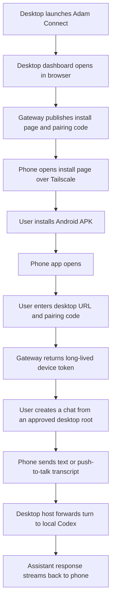

# User Manual

Adam Connect lets your phone talk to the Codex CLI running on your desktop computer over Tailscale. The phone does not need an OpenAI API key. Your desktop stays the trusted bridge.

## Current Status

### Completed In This Checkpoint

- the supported desktop GUI is the browser dashboard opened by `npm run launch`
- the dashboard now includes pairing, host health, Tailscale status, recent sessions, recent devices, QR onboarding, and Android APK download links
- Linux users can install a desktop-menu launcher with `npm run app:desktop:install-launcher`

### Next Up

- run another full real-phone acceptance pass using the dashboard-first setup
- validate iOS on a real build machine
- decide whether to ship the native Electron shell scaffold or keep the browser dashboard as the long-term desktop surface

## Before You Start

- Install Tailscale on the desktop and on your phone.
- Sign both devices into the same Tailscale account.
- Make sure `codex login status` works on the desktop.
- Launch the desktop app:
  Tip: if you want a menu entry on Linux, run `npm run app:desktop:install-launcher` once after install.

```bash
npm run launch
```

- If you want the lower-level terminal-only mode instead, you can still use `npm run dev:desktop-stack`.

- For an installable Android APK from this desktop, use:

```bash
npm run build:android-release
```

- `build:android-debug` is still useful for local Metro-based development, but it is not the right artifact for phone install from the dashboard.

## Quick Flow



## Install On Android

1. On the desktop, run `npm run launch`.
2. The desktop dashboard opens in your browser automatically.
3. Open the phone install page from that dashboard, or scan the QR code.
4. On the phone, visit the Tailscale install page URL shown there if you did not scan.
5. Tap `Download Android APK`.
   The dashboard should serve a release APK when one exists.
6. If Android warns about installing from the browser, allow that browser as an install source.
7. Finish the app install and open Adam Connect.

Typical desktop URLs are:

- Install page: `http://<your-desktop-tailnet-name>:43111/install`
- APK download: `http://<your-desktop-tailnet-name>:43111/downloads/android/latest.apk`
- QR image: `http://<your-desktop-tailnet-name>:43111/install/qr.svg`

## Pair The Phone

1. Open Adam Connect on the phone.
2. Confirm the desktop URL shown by the host or install page.
   The app now pre-fills the desktop URL on builds produced from this desktop, so you usually only need to change it if you are pairing against a different host.
3. Enter the current pairing code.
4. Tap `Pair Phone`.
5. Wait for the host status screen to load.
6. Adam Connect will create a default `Operator` chat automatically the first time you refresh or send a prompt.

Notes:
- The QR code is optional. The real pairing inputs are the desktop URL and pairing code.
- After pairing, the phone stores a long-lived device token.
- That means normal day-to-day use should not require repairing unless you reinstall the app, clear app storage, or move to a new phone.
- The pairing code now stays stable across normal desktop restarts, so remote recovery is less fragile.

The current desktop URL is usually shown near the top of the desktop dashboard and on the phone install page, for example:

- `http://<your-desktop-tailnet-name>:43111`

## Start Your First Chat

1. Open the `Chats` tab.
2. Pick an approved workspace root.
3. Tap `Start Chat`, or just use the default `Operator` chat.
4. Open the chat and type a prompt, or use `Talk To Codex`.
5. Watch the reply stream in real time.
6. Tap `Stop` if you want to interrupt the current run.

## What The Screens Mean

- `Connect`: pair the phone to the desktop using Tailscale, the desktop URL, and the pairing code.
- `Host`: check Codex login state, Tailscale reachability, approved roots, and voice settings.
- `Chats`: create or reopen persistent chat sessions tied to approved desktop roots.
- `Chat`: send messages, use voice transcription, watch streamed replies, and stop active runs.

## Troubleshooting

- If the phone cannot reach the desktop, confirm both devices are connected in Tailscale and use the Tailscale hostname or `100.x.x.x` address.
- If the app says Codex is logged out, run `codex login --device-auth` on the desktop.
- If the Android APK download works but installation is blocked, allow installs from the browser you used to download it.
- If the phone pairs but replies do not appear, check the terminal running `npm run launch`.
- If the phone shows `Unable to load script`, you installed a debug APK that expects Metro. Rebuild with `npm run build:android-release` and reinstall from the dashboard.
- If push-to-talk says voice input is unavailable, confirm the phone has a speech recognition service enabled and set as the default Android voice service.
- If a voice turn transcribes but does not send, check whether `Auto-send voice turns` is enabled on the `Host` screen.
- If you need to rebuild the Android package after code changes for phone install, rerun `npm run build:android-release`.

## Day-To-Day Use

1. Start `npm run launch` on the desktop.
2. Open Adam Connect on the phone.
3. Confirm the `Host` view shows `Codex ready`.
4. Start or reopen a chat.
5. Send text or voice-transcribed prompts.
6. Stop runs from the phone when needed.
