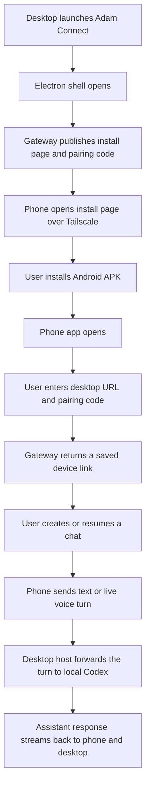

# User Manual

Adam Connect lets your phone talk to the Codex CLI running on your desktop computer over Tailscale. The phone does not need an OpenAI API key. Your desktop stays the trusted bridge.

The near-term product goal is simple: the phone should feel like a persistent remote operator console for Codex, not a thin terminal.

## Current Status

### Completed In This Checkpoint

- the supported desktop GUI is now the Electron shell opened by `npm run launch`
- the shell-facing desktop surface now includes `Operator`, `Activity`, `Devices`, `Workspaces`, and `Settings`
- Linux users can install a desktop-menu launcher with `npm run app:desktop:install-launcher`

### Next Up

- run another full real-phone acceptance pass focused on the operator loop
- tighten pairing recovery, voice send/reply behavior, and shared phone/desktop status messaging
- improve chat readability and session management without losing the low-friction operator flow
- validate iOS on a real build machine
- keep tightening the native shell and the phone-side operator loop before widening scope

## Before You Start

- Install Tailscale on the desktop and on your phone.
- Sign both devices into the same Tailscale account.
- Make sure `codex login status` works on the desktop.
- Launch the desktop app:
  Tip: if you want a menu entry on Linux, run `npm run app:desktop:install-launcher` once after install.

```bash
npm run launch
```

- If you want the lower-level terminal-only mode instead, you can still use `npm run dev:desktop-stack`.
- If you want wake-on-request without keeping the full workstation powered, run the optional wake relay on a low-power LAN node. See [docs/wake-relay-deployment.md](/home/adamgoodwin/code/agents/codex_adam_connect/docs/wake-relay-deployment.md).
- If you want external email delivery, configure Resend in the desktop `.env`. See [docs/outbound-email-setup.md](/home/adamgoodwin/code/agents/codex_adam_connect/docs/outbound-email-setup.md).

- For an installable Android APK from this desktop, use:

```bash
npm run build:android-release
```

- `build:android-debug` is still useful for local Metro-based development, but it is not the right artifact for phone install from the dashboard.

## Quick Flow



## Install On Android

1. On the desktop, run `npm run launch`.
2. The native desktop shell opens automatically.
3. Open `Phone Setup` in the shell, or use the fallback browser install page, then scan the QR code or open the install link on the phone.
4. On the phone, visit the Tailscale install page URL shown there if you did not scan.
5. Tap `Download Android APK`.
   The dashboard should serve a release APK when one exists.
6. If Android warns about installing from the browser, allow that browser as an install source.
7. Finish the app install and open Adam Connect.

Typical desktop URLs are:

- Install page: `http://<your-desktop-tailnet-name>:43111/install`
- APK download: `http://<your-desktop-tailnet-name>:43111/downloads/android/latest.apk`
- QR image: `http://<your-desktop-tailnet-name>:43111/install/qr.svg`

## Pair The Phone

1. Open Adam Connect on the phone.
2. Confirm the desktop URL shown by the host or install page.
   The app now pre-fills the desktop URL on builds produced from this desktop, so you usually only need to change it if you are pairing against a different host.
3. Enter the current pairing code.
4. Tap `Pair Phone`.
5. Wait for the host status screen to load.
6. Adam Connect will create a default `Operator` chat automatically the first time you refresh or send a prompt.

Notes:
- The QR code is optional. The real pairing inputs are the desktop URL and pairing code.
- After pairing, the phone stores a saved device link that should survive normal day-to-day use.
- That means normal day-to-day use should not require repairing unless you reinstall the app, clear app storage, or move to a new phone.
- The pairing code now stays stable across normal desktop restarts, so remote recovery is less fragile.
- Reconnecting to an existing paired desktop should be treated as recovery, not as a full new setup flow.
- If the saved phone token goes stale, Adam Connect keeps the saved desktop URL and device settings so repair is faster than a full new setup.

The current desktop URL is usually shown near the top of the desktop dashboard and on the phone install page, for example:

- `http://<your-desktop-tailnet-name>:43111`

## Start Your First Chat

1. Open the `Chats` tab.
2. Use the project wizard to pick an approved workspace root, name the project, describe the goal, and choose the reply style you want.
3. Tap `Start Project Chat`, or just use the default `Operator` chat for quick turns.
4. Open the chat and tap `Start Voice`, or open the settings gear if you want the manual text composer.
5. Watch the reply stream in real time.
6. Tap `Stop` if you want to interrupt the current run.

For everyday use, prefer the default `Operator` chat unless you intentionally want a separate named project thread.
The `Operator` chat is pinned to the top of the chat list so quick remote turns stay easy to find.
The reply-style control in the wizard and chat screen lets you ask for `Natural`, `Executive`, `Technical`, or `Concise` responses without changing the saved conversation thread.
The chat screen is now intentionally tighter, with a compact top bar, a few small controls, and most of the screen reserved for the conversation itself.
Voice is the default mode in chat, and the settings gear is the manual drawer for typed prompts and manual email editing.

## What The Screens Mean

- `Connect`: pair the phone to the desktop using Tailscale, the desktop URL, and the pairing code.
- `Host`: check Codex login state, Tailscale reachability, approved roots, and voice settings.
- `Host`: also manages wake-on-request and trusted outbound email recipients.
- `Chats`: create or reopen persistent chat sessions tied to approved desktop roots, including project kickoff prompts.
- `Chat`: send messages, run the live voice loop, watch streamed replies, and stop active runs.
- `Chat`: the top-right voice controls also include `Mute` while a live voice session is running, so you can keep the session open without listening to your side in a noisy room.

The phone and desktop should present the same broad picture of what is happening: online/offline state, run status, recent recovery needs, and whether Codex is ready.
The phone chat view now also shows clearer message roles, timestamps, and code blocks so longer replies are easier to scan.

## Troubleshooting

- If the phone cannot reach the desktop, confirm both devices are connected in Tailscale and use the Tailscale hostname or `100.x.x.x` address.
- If the app says Codex is logged out, run `codex login --device-auth` on the desktop.
- If Android background updates stay unavailable, confirm `google-services.json` is present in `apps/mobile/android/app/` and the desktop `.env` includes `FCM_SERVER_KEY`.
- If the Android APK download works but installation is blocked, allow installs from the browser you used to download it.
- If the phone pairs but replies do not appear, check the terminal running `npm run launch`.
- If the phone shows `Unable to load script`, you installed a debug APK that expects Metro. Rebuild with `npm run build:android-release` and reinstall from the dashboard.
- If voice says it is unavailable, confirm the phone has a speech recognition service enabled and set as the default Android voice service.
- Use `Host -> Voice -> Test Spoken Reply` to verify that the phone itself can play a spoken reply before debugging the live conversation loop.
- On Android, Adam Connect now prefers Expo speech output for spoken replies and falls back to the older Android text-to-speech module if needed.
- On Android, Adam Connect pauses the recognizer briefly while it plays a spoken reply, then resumes listening automatically for the next turn. If you still do not hear reply audio, first check the phone's media volume and Android speech output settings.
- The live voice loop now waits briefly before auto-sending a just-finished transcript, so a short mid-sentence pause is less likely to be treated as a brand-new turn.
- If the live voice loop keeps reconnecting, pull to refresh once and confirm the realtime websocket is still healthy.
- If a voice turn pauses for review instead of sending, Adam Connect likely decided the transcript was long or risky enough to require confirmation first.
- If the app says the desktop link needs repair, use the saved desktop URL and current pairing code instead of disconnecting and re-entering everything manually.
- If a chat says it is busy while the live voice loop is active, Adam Connect should now stop the current run automatically before sending the next spoken turn. If it still looks stuck, pull to refresh once and then use `Stop`.
- `Stop` now also works as a recovery action for the current or fallback chat, even if the phone UI is no longer showing that chat as busy.
- `Stop` also ends the live voice loop on the phone now, so the mic should stop listening immediately when you use it during a voice session.
- On Android, Adam Connect now asks the recognizer to stop cleanly first, then force-cancels it if needed, so the microphone is less likely to stay latched after a manual stop or while reply audio is starting.
- Adam Connect now also force-clears Android recognition on app startup and before the spoken-reply test, so stale native listening state is less likely to block reply audio even when the UI already says voice is idle.
- If the desktop is asleep, use `Host -> Wake Homebase` after you configure the wake relay on the desktop and the always-on LAN node.
- If you want to email a completed Codex reply outside Adam Connect, add a trusted recipient on `Host`, then use `Email this reply` on the exact assistant message you want to send.
- Adam Connect can also detect a natural spoken email request such as “email me that link” or “email this to name@example.com”, prepare the draft when the reply finishes, and wait for a final confirmation before it sends.
- Adam Connect now also tries to understand spoken-form addresses such as `freedom at agoperations dot ca` when speech recognition does not render the literal email characters cleanly.
- When an email draft is waiting, Adam Connect should say the destination back to you and you can confirm by voice with `yes, send it` or cancel with `cancel`.
- If you want to edit a typed prompt or email draft manually, open the settings gear in chat to reveal the manual tools without leaving the voice-first view.
- If you are in a noisy space, use `Mute` in the chat header to keep the voice session alive without continuously listening to your side. Adam Connect will now hold the unfinished spoken turn you already started, then let you continue it after you unmute.
- Outbound email uses the desktop gateway's provider credentials. The phone never stores the sender API key.
- The chat view now shows a spinning working bubble while Adam Connect is still sending or waiting on a turn, so it is easier to tell the difference between “busy” and “hung”.
- If you need to rebuild the Android package after code changes for phone install, rerun `npm run build:android-release`.

## Day-To-Day Use

1. Start `npm run launch` on the desktop.
2. Open Adam Connect on the phone.
3. Confirm the `Host` view shows `Codex ready`.
4. Reconnect to your existing paired desktop if needed using the saved URL and stable pairing code.
5. Use the default `Operator` chat for quick turns, or open a named project chat when you want a separate thread.
6. Send text prompts or use the live voice loop.
7. Stop runs from the phone when needed.
